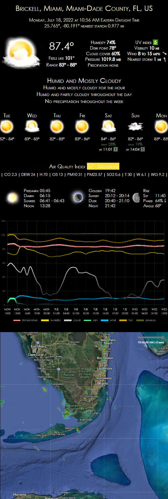

# Weather

Yet another weather app

## Platforms

Fully rendered in browser, no server-side components required

## References

- [DarkSky](https://darksky.net/dev/docs)
- [Tomorrow.io](https://docs.tomorrow.io/reference/welcome)
- [Leaflet](https://leafletjs.com/reference.html)
- [Google Maps](https://developers.google.com/maps/documentation/geocoding/requests-geocoding)
- [AQIcn](https://aqicn.org/json-api/doc/)

## Screenshot

## Todo

https://to-fujita.github.io/Babylon.js_3D_Graphics/Babylon_105_animated_earth.html
https://github.com/To-Fujita/Babylon.js_3D_Graphics/blob/master/Babylon_105_animated_earth.html
https://github.com/firdodev/Solar-System-BabylonJS
